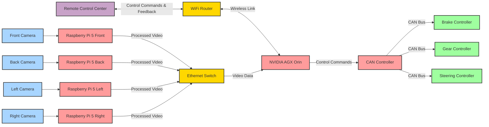

# RVCE
Proof Of Concept
## architecture:

## Step by step work
1. [Trial of making the communication stack with Camera to Server](./com/communication.md)
2. Camera BOM (this is for development, inspired by [link](https://datarootlabs.com/blog/hailo-ai-kit-raspberry-pi-5-setup-and-computer-vision-pipelines#implementing-custom-detection-tracking-pipeline))

| Item No. | Component                                        | Specification      | Qty | Est. Cost (£) | Sample Image                                                                                              | Link                                                                                   | Notes                                                |
|----------|--------------------------------------------------|---------------------|-----|----------------|-----------------------------------------------------------------------------------------------------------|----------------------------------------------------------------------------------------|------------------------------------------------------|
| 1        | Raspberry Pi 5 Model B                           | 8GB RAM             | 1   | 76.8           |  | [Link](https://thepihut.com/products/raspberry-pi-5?variant=42531604955331) |                                                      |
| 2        | AI Bundle (Hailo 8L) for Raspberry Pi 5         | AI Bundle           | 1   | 91.8           |  | [Link](https://thepihut.com/products/ai-bundle-hailo-8l-for-raspberry-pi-5) |                                                      |
| 3        | 12MP IMX708 HDR 120° Camera                     | 120° FOV            | 1   | 34.7           |  | [Link](https://thepihut.com/products/arducam-12mp-imx708-hdr-120-wide-angle-camera-module-with-m12-lens-for-raspberry-pi) | Arducam 12MP IMX708 HDR 120° Camera Module with Wide-Angle M12 Lens for Raspberry Pi |
| 4        | Pinedrive 256GB NVMe SSD (2280)                 | 256GB, 2280         | 1   | 35.91          |  | [Link](https://thepihut.com/products/pinedrive-256gb-nvme-ssd-2280) |                                                      |
| 5        | Active Cooler                                    | Pi 5 Compatible     | 1   | 5.2            |  | [Link](https://thepihut.com/products/argon-thrml-30mm-active-cooler-for-raspberry-pi-5) | Argon THRML 30mm Active Cooler for Raspberry Pi 5  |
| 6        | MicroSD Card                                    | 32GB Class 10       | 1   | 9.9            |  | [Link](https://thepihut.com/products/noobs-preinstalled-sd-card) | Official Raspberry Pi Micro SD Card with RPi OS Pre-Installed |
| 7        | Custom Case                                      | Fits Pi 5 + AI bundle | 1   | 8              |  | [Link](https://thepihut.com/products/layer-case-for-pineboards-hats) | Just for a development                               |
| 8        | Mounting Kit                                     | Tripod Mount        | 1   | 8.4            |  | [Link](https://thepihut.com/products/die-cast-tripod-mount-for-raspberry-pi-camera-modules) | Die-cast Tripod Mount for Raspberry Pi Camera Modules |
| 9        | Camera Mount                                     | Adjustable          | 1   | 5              |  | [Link](https://thepihut.com/products/extendable-tripod-for-raspberry-pi-hq-camera) | Extendable Tripod for Raspberry Pi HQ Camera       |
| 10       | Mini HDMI Cable                                  | 1m length           | 1   | 3.8            |  | [Link](https://thepihut.com/products/hdmi-to-micro-hdmi-cable-2m-gold-plated?variant=40818117050563) |                                                      |

Total Cost : £279.51

